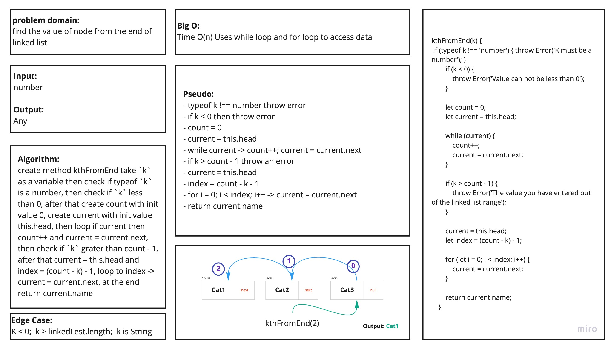

# data-structures-and-algorithms

# Linked List
 - This code will create a **Linked List** 
    - Insert method takes any value as an argument and adds a new node with that value to the head
    - Include method which takes any value as an argument and returns a boolean result depending on whether that value exists as a Node’s value somewhere within the list.
    - toString method takes in no arguments and returns a string representing all the values in the Linked List, formatted as: `"{ a } -> { b } -> { c } -> NULL"`

    - append(value) which adds a new node with the given value to the end of the list
    - insertBefore(value, newVal) which add a new node with the given newValue immediately before the first value node
    - insertAfter(value, newVal) which add a new node with the given newValue immediately after the first value node

    - kthFromEnd(k) Return the node’s value that is k from the end of the linked list.

## Challenge
Define three method 
- insert method take a value as argument and add it to a newe Node
- include method take a value and return a boolean wether its exists as a node or not
- toString method return all values in the linked list as string.

- append method take a value and add the new value at the end of list
- insertBefore method take two value the first is the search value and the second is the newe value and then add thee nwew value before the value
- insretAfter method take two value the first is the search value and the second is the newe value and then add thee nwew value after the value

- kthFromEnd method take numbre and the method will return the value of that index.

## Approach & Efficiency
- create a **linked list** have a methods to add nodes.
- create another method to search in the **linked list** using while loop.
- Insertion method, at last, aftre value, and before value
- Search method from the end of the **linked list** end take a `k` as a variable, and it rreturn the value of that index, this method will check if `k` grater/smaller than list length, and must be a number 

