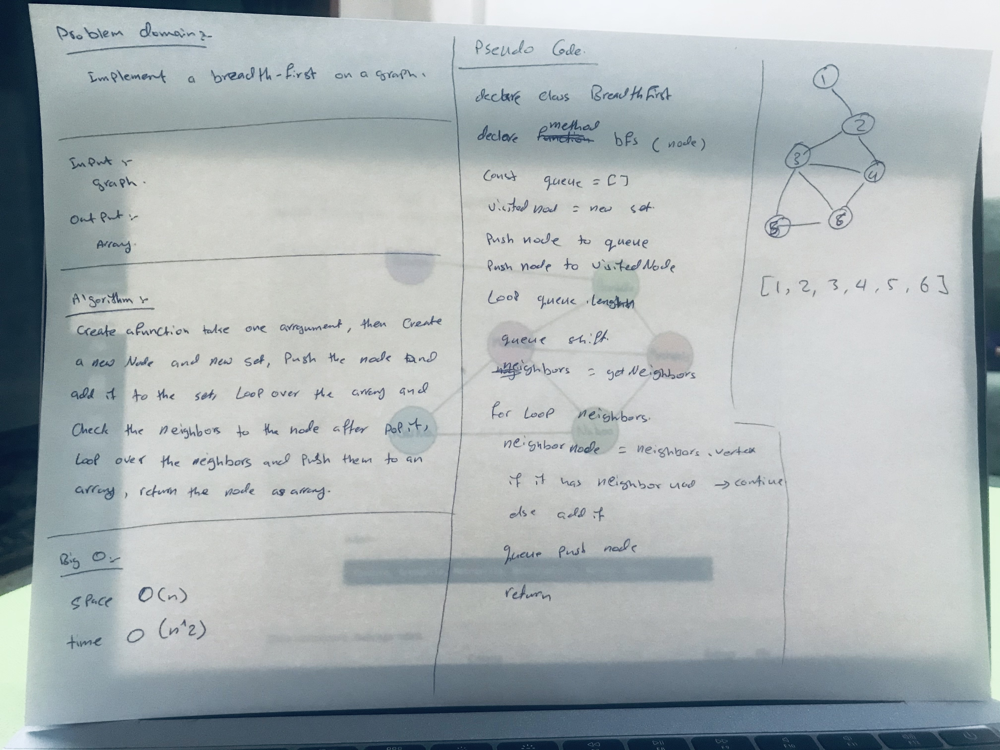

# Graph

## Challenge
Extend your graph object with a breadth-first traversal method that accepts a starting node.
return a collection of nodes in the order they were visited. Display the collection.

## Approach & Efficiency
I used for Classes ,for and while loops , if statment

## Big O
space(n)
time(n^2)

## Solution
