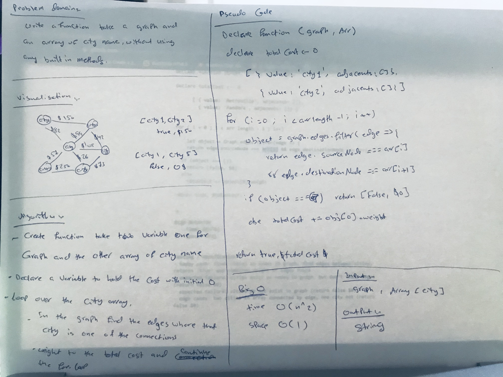

# Graphs - Get Edges

## Challenge
This challenge was to create a function that takes in a graph and an array of city names and return whether the trip between cities is possible with direct flights, and how much it would cost.

## Approach & Efficiency
- In this function we'll be working with the edges of the graph since those contain the information about how the nodes (cities) are connected, and the weight between the two which for this sake we'll assume is the cost of travel.
- We should first declare a variable to assign to our "total trip cost" that we'll be incrementing if we find relevant edges. We'll want to set up a for loop to iterate through our array of city nodes, and do some stuff inside that loop. We have access to a full Graph with it's edges property (as I've implemented the original Graph class) so we'll next want to filter over those edges. As we filter over that array of edge objects, we'll be checking to see if the sourceNode property of the edge has a value of our first city name, and if so we'll next check to see if the edge's destinationNode value is the second city in the array (so we'll be checking the array at index [i] and also index [i+1]). We'll assign that filter action to a variable.
- Next in the for loop is to check that variable and see if it has any length to it, and if not we know that it has not found an edge between the first two cities and we're done with the whole thing so we can return 'false $0' and be done with it. However, if there is length to the array, that means we've found and edge and we next want to access it's weight property and add the value of that to our global total trip cost variable.
- This process will continue up until the length of the array - 1, since we don't care about the last item in the city array.
- As a last step, if we've made it this far and haven't returned False $0 out yet, we will return True with our total cost.

## Big O
- BigO time: O(n^2): we're filtering over an array inside of a for loop, so unfortunantely we're looking at n^2
- BigO space: O(1): the only additional space we're utilizing is the space needed to hold the result of the filter action, and even though it could happen n times, it will only every be 1 item long and it gets overwritten on each iteration of the loop.

## Solution

