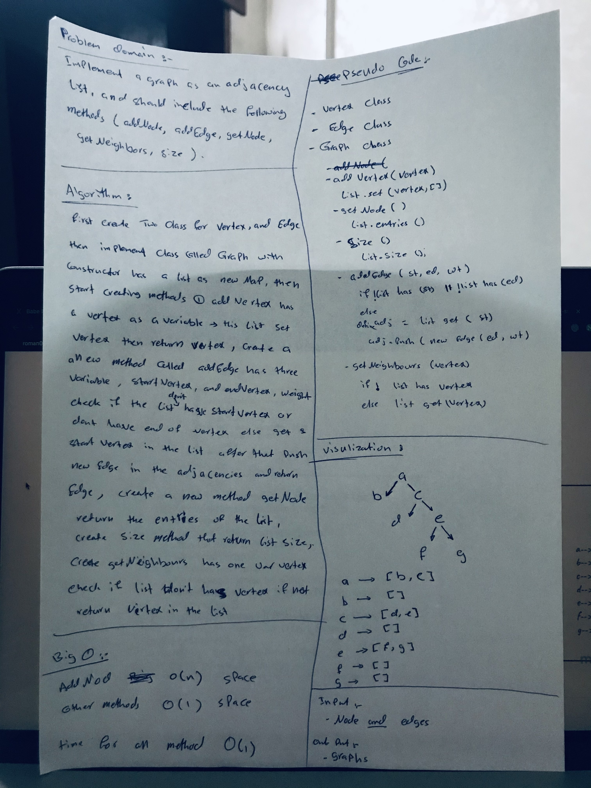

# Graph
A graph is a common data structure that consists of a finite set of nodes (or vertices) and a set of `edges` connecting them. A pair (x,y) is referred to as an edge, which communicates that the x `vertex` connects to the y `vertex`. In the examples below, circles represent vertices, while lines represent edges.

## Challenge
Implement a graph should be represented as an adjacency list, and should include the following methods:

```javascript
AddNode()
AddEdge()
GetNodes()
GetNeighbors()
Size()
```

## Approach & Efficiency
Definning a class for Vertex, a class for edges, and a class for the graph which uses JS Map()

## Big O
- Time **O(1)** for all methods
- Space
   - **O(n)** for addVertex
   - **O(1)** for other methods

## Solution
