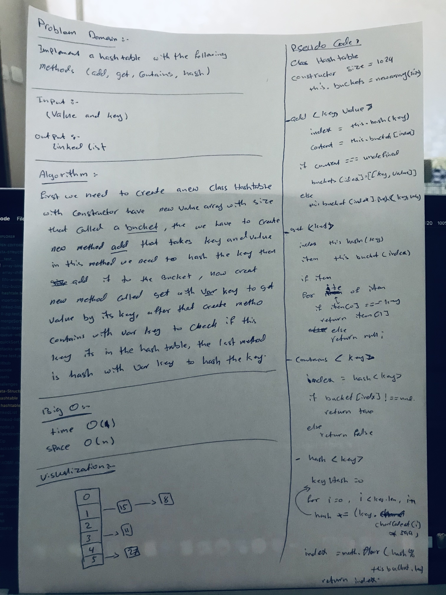

# Hashtable

## Challenge
This challenge was to implement a Hash Table data structure with the methods as described below.

## Approach & Efficiency
The approach here was to create a Hashtable class with the associated methods. The constructor in the class would hold the containers for the table using Javascript's built in Array object, with a default value of 1024 "buckets" but the ability to set the size each time it's instantiated.

Big(O) space: the structure for this is an array, and an array of arrays when a collision occurs, so it is O(n) dependant on the size when it's instantiated (or default)

Big(O) time: accessing the hashtable is actually pretty efficient so it would be constant, O(1)

## API
### add method
This method's signature is a key and a value as parameters, and doesn't return anything. The method will hash the key to create an index, and then insert that value at the index. This method will also account for collisions in that it will check if there is anything at that index (the hashed key) and if not, it will simply insert the key and value as an array. If there is already something at that index, it will push the new key and value array into that bucket. This will create an array of arrays at that index.

### get method
This method's signature is a key as a parameter, probably a string. It will return the value that exists at that key which is type any, and will return null if there is nothing at that key.

### contains method
This method's signature is a key as a parameter and will return a boolean indiciating if the key exists in the table already. The method will use the hash method to hash the key, and then check the containers to see if that index exists. If so, return true and if not, return false.

### hash method
Where the magic happens! This method's signature is a key, probably a string, and it will return a hashed index value which will be an integer. This method uses a for loop to iterate over each character in the key input, add it's ASCII value multiplied by the prime number 599, and then will return the value of that number divided by the size of the buckets of the table. Badda bing badda boom.

