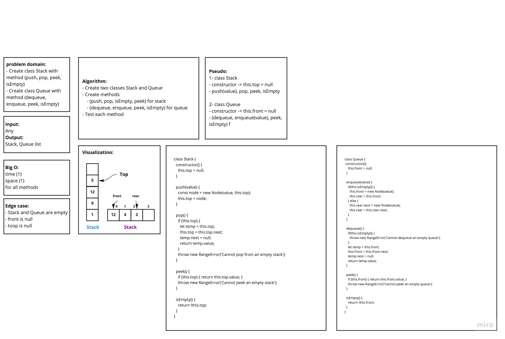

# Queue with Stack  :
this code will create a **Queue** usibg two **Stack** , **PseudoQueue** class will create the standard **queue** interface .

[PR Link](https://github.com/waleedafifi-401-advanced-javascript/data-structures-and-algorithms/pull/13)

## Challenge
- Create a new **Stack** class, with `push()` , `pop()` , `peek()` and `isEmpty()` methods.
- Create a new **Queue** class, with `dequeue()` , `enqueue()` , `peek()` and `isEmpty()` methods.

## Approach & Efficienc
- create two stacks and used the `push` method to add to the first stack and used `pop` to remove from the other one 
- push all the nodes in the first **stack** to the second one so when i used `pop` .
- take what was first element added , to make the first in first out (**queue**).

#### Big O:
- the **Big O** is o(1) for bothe **space** and **time**, because all methods check the valuse once without using loops.

