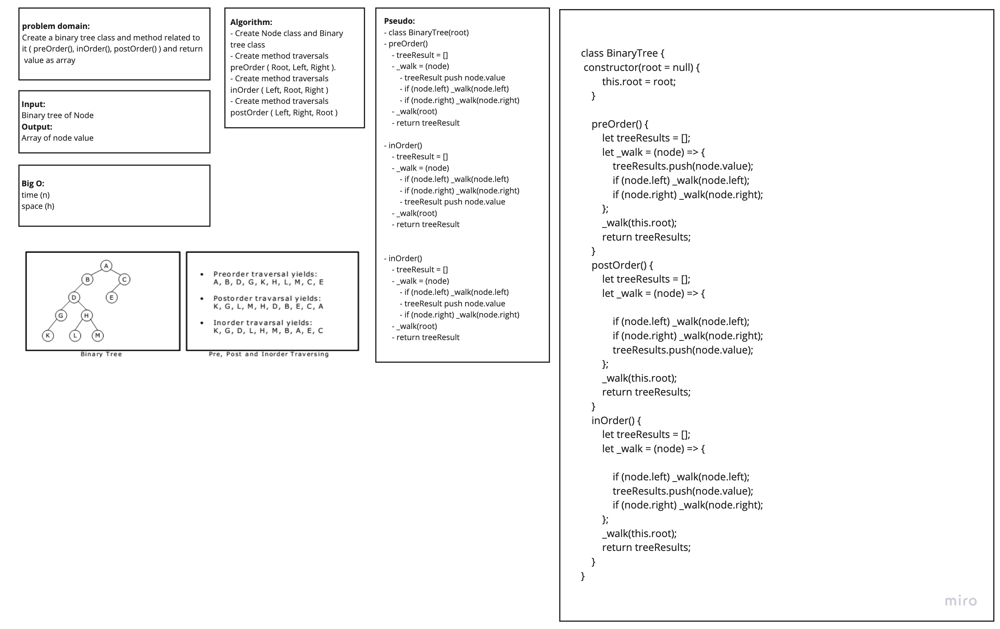
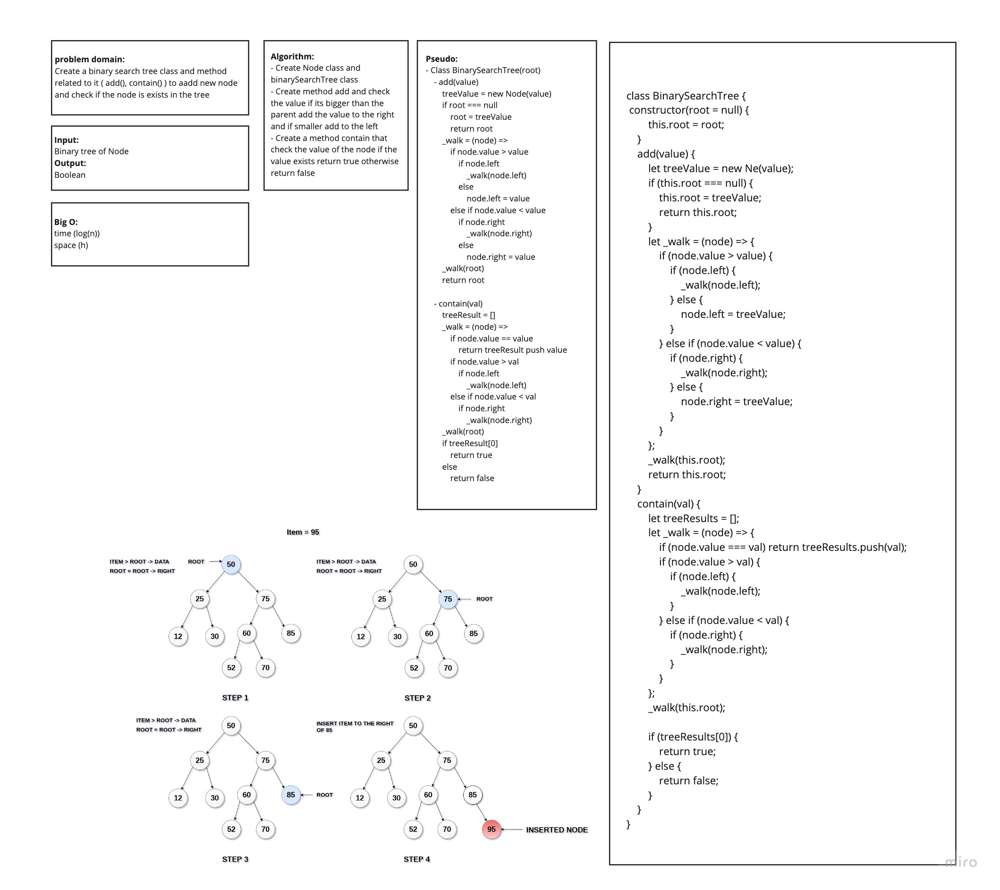

# Tree

### Challenge
- Write a binary tree class with `preOrder()`, `inOrder()`, and `postOrder()` methods. 
- Write a binary search tree class with `add()` and `contains()` methods.

### Approach and Efficiency
- `preOrder()` - Takes no arguments. Makes and returns an array of the tree items in the order center, left, right.
- `inOrder()` - Takes no arguments. Makes and returns an array of the tree items in the order left, center, right
- `postOrder()` - Takes no arguments. Makes and returns an array of the tree items in the order left, right, center
- `add()` - Takes one value as an argument. Adds that value at the correct node in a binary search tree
- `contains()` - Takes one value as an argument. Returns true if the value is in the tree, and false if not.

**binarytree**
- **Big O** for time is *O(n)* becuse it depend on the number of the nodes
- **Big O** for space is *O(h)* becuse it depend on the height of tree

**binarysearchtree**
- **Big O** for time is *O(log(n))* becuse it depend on the number of the nodes
- **Big O** for space is *O(h)* becuse it depend on the height of tree

***

