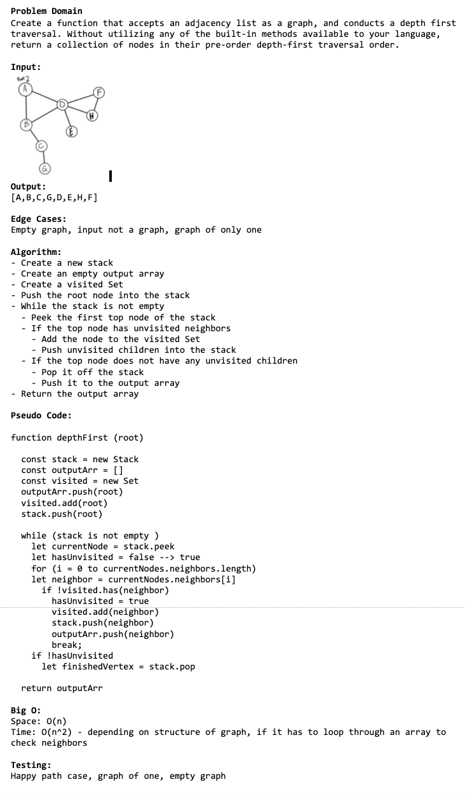

# Challenge Summary
Conduct a depth first preorder traversal on a graph

## Challenge Description
Create a function that accepts an adjacency list as a graph, and conducts a depth first traversal. Without utilizing any of the built-in methods available to your language, return a collection of nodes in their pre-order depth-first traversal order

## Approach & Efficiency
I used ,for and while loops , if statment

## Big O
space(n) declared new array and new set
time(n^2) since I will loop through each node and it neighbors

## Solution
