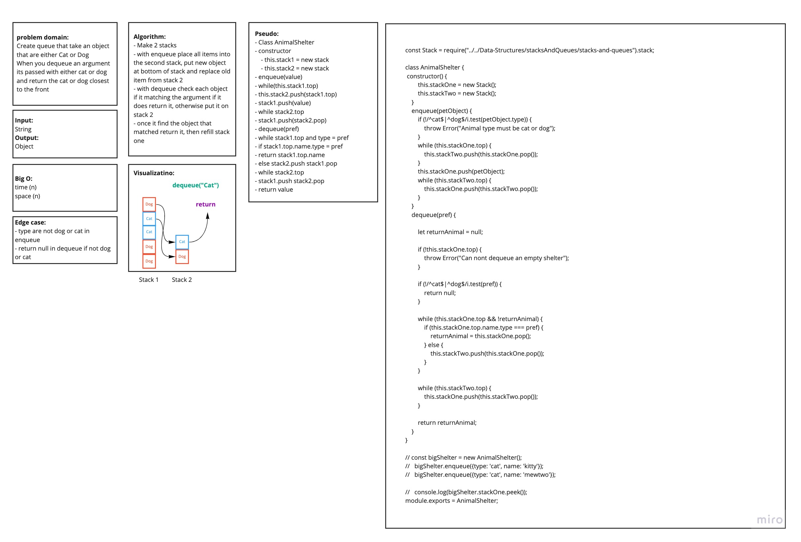

# data-structures-and-algorithms

# Stack and Queues:
- Create a class called AnimalShelter which holds only dogs and cats. The shelter operates using a first-in, first-out approach.
- Implement the following methods:
  - enqueue(animal): adds animal to the shelter. animal can be either a dog or a cat object.
  - dequeue(pref): returns either a dog or a cat. If pref is not "dog" or "cat" then return null.

## Approach & Efficiency
- create **AnimalShelter** class with two properties (back and front) to make it esier for me to add and romove when I create **enqueue** and **dequeue** methods that use **first-in, first-out** approach.

#### Queue:
- Big O id **O(n)** forr both method because of loops

## Solution

