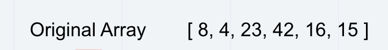
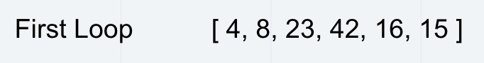
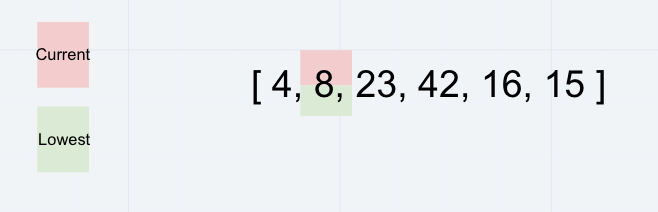
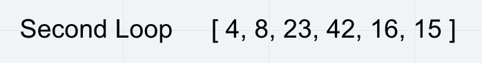
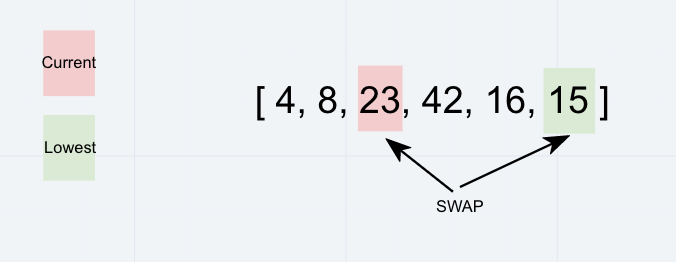
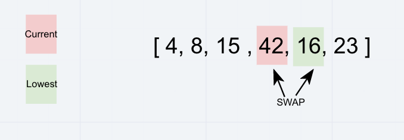
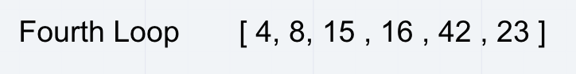
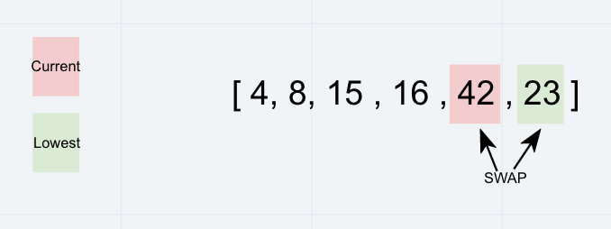
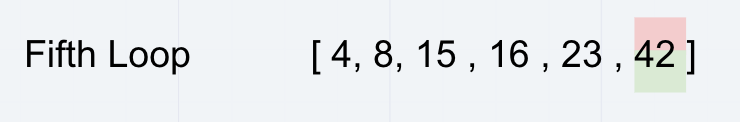

# Insertion Sort

### BIG O
* space **O(n)** memory will depend on the original tree so it vary
* time **O(n^2)** two nested loops


## Challenge
### Psedo code 

```
FOR i = 1 to arr.length  
  int j <-- i - 1
  int temp <-- arr[i]
      
  WHILE j >= 0 AND temp < arr[j]
    arr[j + 1] <-- arr[j]
    j <-- j - 1
      
  arr[j + 1] <-- temp

```

### Code 
``` 
function InsertionSort(arr) {
  for (let i = 0; i < arr.length; i++) {
    let j = i - 1;
    let temp = arr[i];
    
    while (j >= 0 && temp < arr[j]) {
      arr[j + 1] = arr[j];      
      j--;
    }
    arr[j + 1] = temp;
  }
  return arr;
}
```

### test
```
describe('Sort array', () => {
  it('can sort the array', () => {
    let arr = [2, 4, 7, 1];
    expect(insertionSort(arr)).toStrictEqual([ 1, 2, 4, 7 ]);
  });

  it('can sort the array', () => {
    let arr = [5,12,7,5,5,7];
    expect(insertionSort(arr)).toStrictEqual([ 5, 5, 5, 7, 7, 12 ]);
  });

  it('can sort the array', () => {
    let arr = [20,18,12,8,5,-2];
    expect(insertionSort(arr)).toStrictEqual([ -2, 5, 8, 12, 18, 20 ]);
  });
});
```


## Solution

Given the following array, we need to compare the numbers inside of the array, and ouptut a return array, with the numbers sorted from least to greatest. 



Here we are comparing the values in the first index position to all of the other numbers in the array.  8 will compare itself to 4, 23, 42, 16, and 15. 


If any of the other numbers is lower than 8, it will take the place of 8. In this case, 4 is lower, and will take the value of the lowest, as we traverse through the rest of the array.  Since there aren't any values less than 4, 4 takes the place of 8, resulting in the following array. 



We now move to the next index position [1] and compare 8 to the rest of the array. 



8 is the next lowest number and will retain its position in the array, resulting in the following array. 



We now compare the next index position [2] which is 23.  23 compares itself to the rest of the array.  It is smaller than 42 so it retains its position.  It is larger than 16 so 16 now takes a temporary position of the smallest.  16 is now compared to the rest of the array, in this instance, 15.  Since 15 is the smallest value, it will take position [2].



Resulting in the following array


We repeat the exact same steps for position [3].  



- Resulting in the following array. 
- Continuning down the rest of the array. 





Now that we have reached the end, the last index position is comparing itself to itself, making it the largest value in the array.  



Resulting in the final output array.

