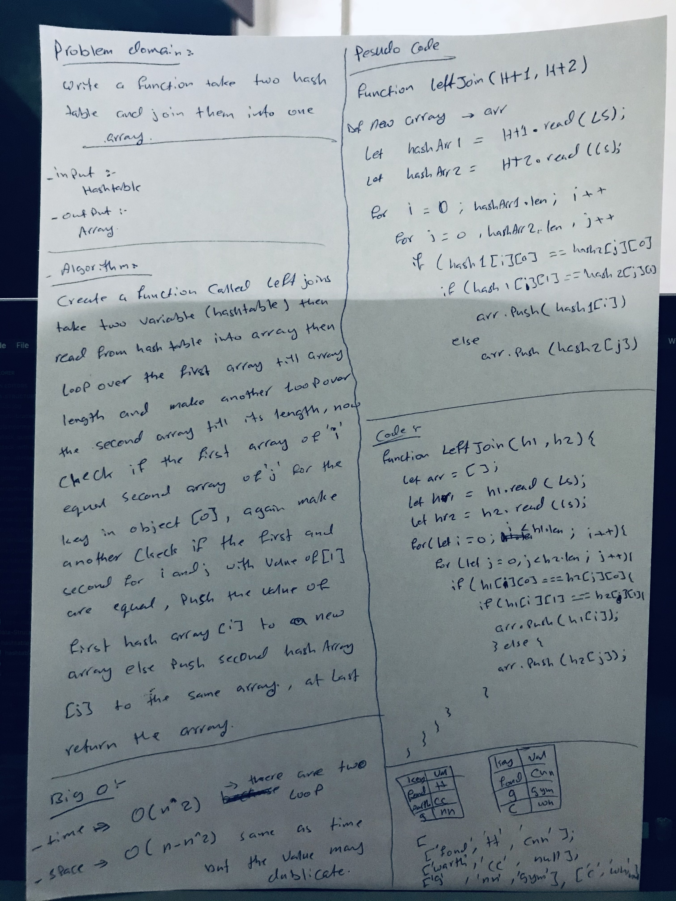

# Hashmap LEFT JOIN
Implement a simplified LEFT JOIN for 2 Hashmaps.

## Challenge
- Write a function that LEFT JOINs two hashmaps into a single data structure.
- The first parameter is a hashmap that has word strings as keys, and a synonym of the key as values.

## Approach & Efficiency
Our general approach here was to use a hashtable to store all the values from the traversal of the first input tree, using our Hashtable implementation and the add method. We'll use recursion to traverse the tree (in a preOrder style), calling the helper function initially with the tree's root and then calling recursively with root.left and root.right. Once we traverse the whole first tree and add each value to the hashtable container, we'll declare an empty array to hold the results values (which are the duplicates, and will eventually be returned). We now need to traverse the second tree input, using a second helper function, and each time run the hashtable get method on the root's value. If that comes back because it's already in the hashtable, we'll know it's a duplicate and we'll push that value to the results array. We'll do the same in calling this function recursively to traverse the entire tree in a preOrder fashion.

## Big O
- time: O(n^2)
- space: O{n - n ^ 2}

## Solution
