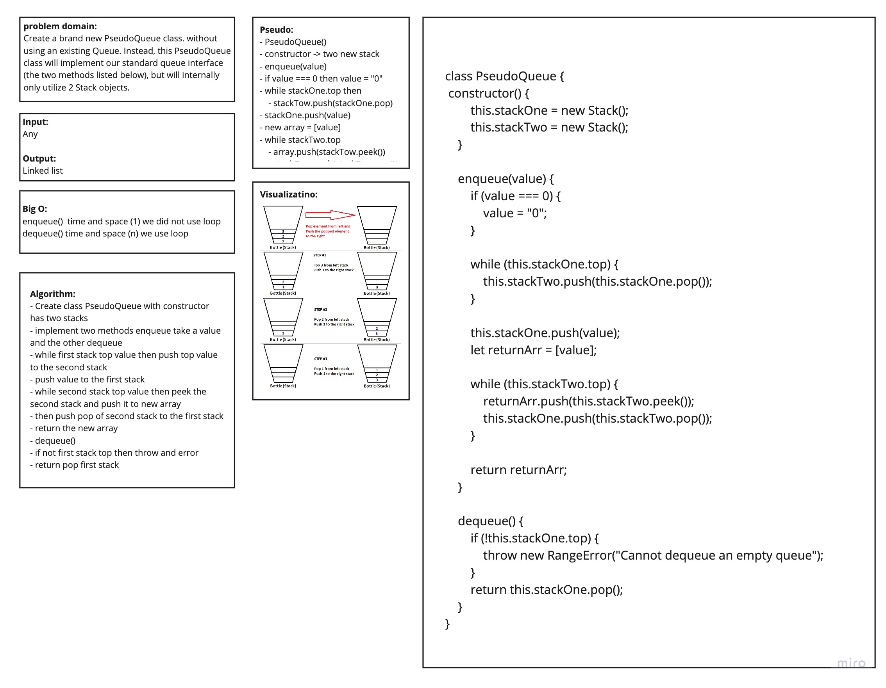

# Queue with Stack  :
this code will create a **Queue** usibg two **Stack** , **PseudoQueue** class will create the standard **queue** interface .

## Challenge
Create a brand new `PseudoQueue` class. Do not use an existing `Queue`. Instead, this PseudoQueue class will implement our standard queue interface (the two methods listed below), but will internally only utilize **2** Stack objects. Ensure that you create your class with the following methods: `enqueue(value)` , `dequeue()`

## Approach & Efficiency
- create two stacks and used the `push` method to add to the first stack and used `pop` to remove from the other one 
- push all the nodes in the first **stack** to the second one so when i used  `pop` .
- take what was first element added , to make the first in first out (**queue**).

#### Big O:
- the **Big O** is **O**(1) for bothe **space** and **time**, for `dequeue`
- the **Big O** is **O**(n) for bothe **space** and **time**, for `enqueue`

## Solution

