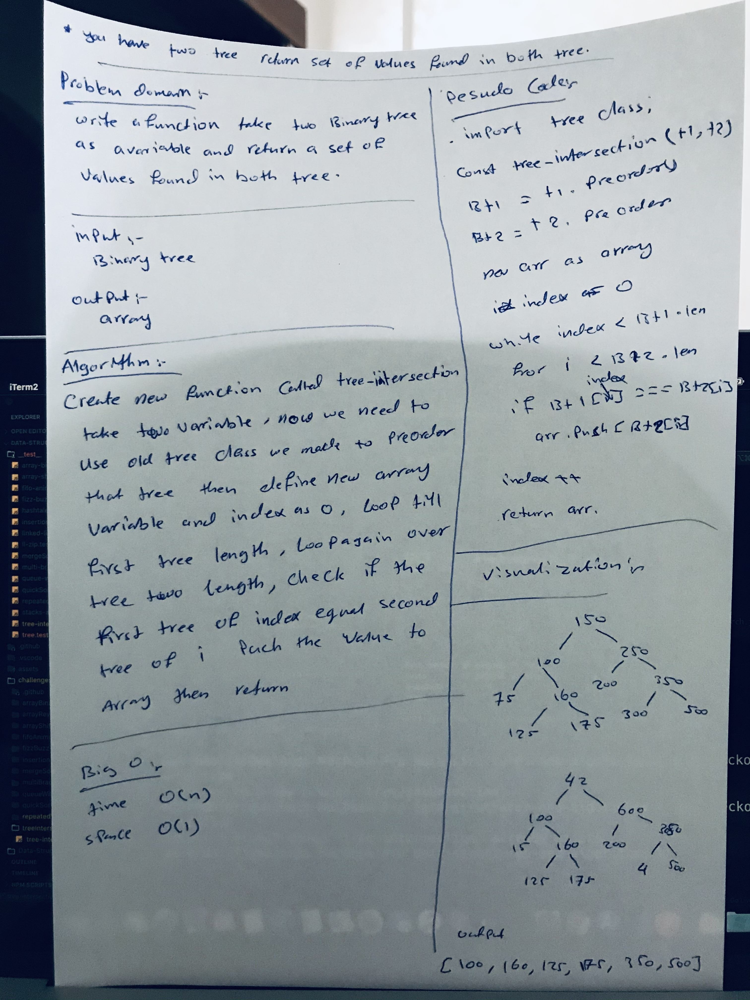

## Tree Intersection

### Challenge
- Write a function called tree_intersection that takes two binary tree parameters. Without utilizing any of the built-in library methods, and return a set of values found in both trees.

### Approach & Efficiency
- I used function, for loop, if statements, and while loop.

### Big O:
Time: O(n), Space: O(1)

### Solution
